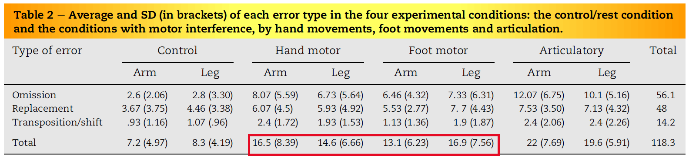
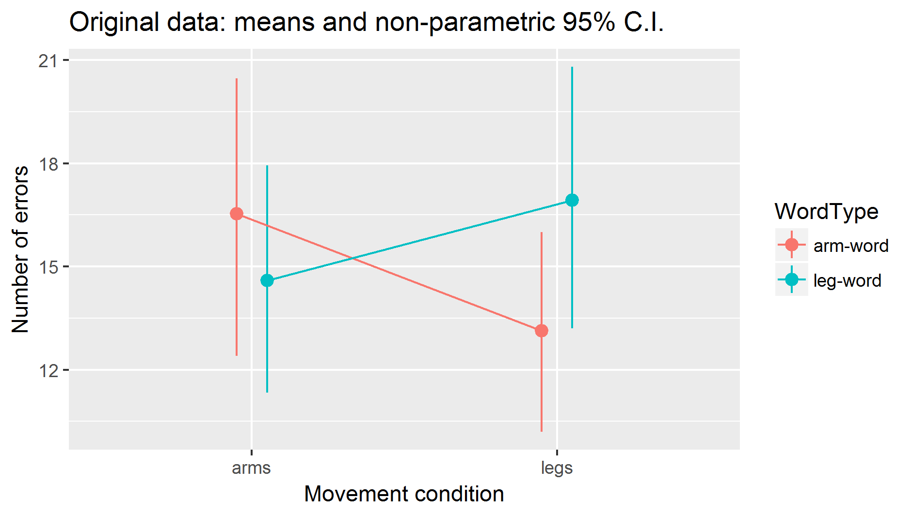

```{r setup, include=FALSE}
library(knitr)
library(ggplot2)
# library(plyr)
library(dplyr)
# library(mvtnorm)
# library(tidyr)
# library(lme4)
# library(broom)  # access summaries from fitted models
knitr::opts_chunk$set(echo = FALSE)
```


Introduction
============

This report summarizes the results of a power analysis for a conceptual 
replication of Shebani & Pulvermüller (2013, Cortex), henceforth S&P. 
The actual script that generates the simulations can be found
[here](https://github.com/montero-melis/2018_replication_sheb-pulv2013/blob/master/1810_replication-natives_analysis/power-analysis/power-analysis_pilot_natives_poisson.R).

In S&P, participants had to memorize groups of
four words (quadruples) that were either arm- or leg-related (word type). Each
block consisted of 24 such quadruples, 12 of each type. Between blocks they
manipulated the conditions under which the words had to be kept in memory. We
simplify their original design to a 2x2 within-subjects factorial design:

- *Movement*: arm or leg movement -- manipulated between blocks
- *WordType*: arm or leg verbs -- manipulated within blocks but between quadruples
(= trials)

We want to estimate the power for finding the most interesting effect reported
in S&P: An interaction of WordType (arm vs leg verb) and MovementType (arm vs
leg movements), leading to worse memory for arm than for leg verbs when
performing arm movements, and to worse memory for leg than for arm verbs when
performing leg movements.


Info provided in the paper
-------------

The dependent variable is the total number of errors made by a participant in
each of the four experimental cells defined by the 2-by-2 design.
The following table from the original paper summarizes the cell means, 
averaging over subjects.




Data set shared with us
--------------------

The first author shared the data file that went into the reported analyses,
but we have agreed not to share it. Here is *made up* data with the same
structure as the file we got:

```{r, echo = FALSE}
read.csv("madeup_data.csv") %>% head(., 9) %>% kable
```


Here is a plot of the *real* data showing cell means and confidence intervals
obtained from non-parametric bootstrapping (i.e., not assuming normality):




Power analyses
=============

The power analyses are done in the separate R-script 
`power-analysis_pilot_natives_poisson.R` (source code can be found
[here](https://github.com/montero-melis/2018_replication_sheb-pulv2013/blob/master/1810_replication-natives_analysis/power-analysis/power-analysis_pilot_natives_poisson.R)).

The analyses consist of the following steps:

1. Fit an appropriate Poisson generalized linear mixed model (GLMM) to the
*original* data set.
2. Generate a large number of data sets from the distribution of coefficients
estimated by the model. This captures uncertainty in both the fixed effects
and the random effects part of the model.
3. Repeat step 2 for each set of parameters that we want to manipulate, namely
the size of the critical effect and the number of participants.
4. Fit an appropriate Poisson GLMM to each such data set.
5. From each model, extract a test-statistic to decide whether the result
is significant or not (in this case, the z-value for the interaction estimate).


Model fit to the original data
-----------------------------

Here is the summary of the model of the original data set; we use the parameter
estimates below in our power simulations:

```
> summary(glmm_poi)
Generalized linear mixed model fit by maximum likelihood (Laplace Approximation) ['glmerMod']
 Family: poisson  ( log )
Formula: nbErrors ~ 1 + Movement * WordType + (1 + Movement * WordType |      Subject)
   Data: d_crit
Control: glmerControl(optimizer = "bobyqa", optCtrl = list(maxfun = 1e+05))

     AIC      BIC   logLik deviance df.resid 
   397.1    426.4   -184.5    369.1       46 

Scaled residuals: 
     Min       1Q   Median       3Q      Max 
-1.68516 -0.46864  0.06156  0.43853  1.45481 

Random effects:
 Groups  Name                                      Variance  Std.Dev. Corr          
 Subject (Intercept)                               2.134e-01 0.461946               
         Movementarms_vs_legs                      3.090e-02 0.175788 0.25          
         WordTypearmW_vs_legW                      1.573e-03 0.039658 0.79 0.79     
         Movementarms_vs_legs:WordTypearmW_vs_legW 4.366e-05 0.006608 0.86 0.70 0.99
Number of obs: 60, groups:  Subject, 15

Fixed effects:
                                           Estimate Std. Error z value Pr(>|z|)    
(Intercept)                                2.619681   0.125145  20.933   <2e-16 ***
Movementarms_vs_legs                       0.005052   0.058905   0.086   0.9317    
WordTypearmW_vs_legW                      -0.043961   0.038500  -1.142   0.2535    
Movementarms_vs_legs:WordTypearmW_vs_legW  0.087994   0.037113   2.371   0.0177 *  
---
Signif. codes:  0 ‘***’ 0.001 ‘**’ 0.01 ‘*’ 0.05 ‘.’ 0.1 ‘ ’ 1

Correlation of Fixed Effects:
            (Intr) Mvmn__ WTW__W
Mvmntrms_v_ 0.187               
WrdTyprW__W 0.219  0.118        
Mv__:WTW__W 0.016  0.063  0.015 
```

Note the interaction comes out significant as in the original analysis.


Power simulations
----------------

The simulations generate new data capturing all the uncertainty in the model
fitted to the original data. However, we also manipulate the following two
factors:

- *Size of the effect*: as in the original or fractions of it (orig times .75,
.5, .25 and 0)
- *N* or number of participants; 15, 30, 45, 60.


### The simulation data

```{r, echo=FALSE}
# Retrieve summaries of all the simulations
simul_summaries <- read.csv("simulations/poisson_sim_summaries_fixed-interactions.csv")
```

The results of fitting a model in each simulation are stored in a *very long*
data frame (`r nrow(simul_summaries)` rows). The rows for *one* simulation
look like this:

```{r, echo=FALSE}
simul_summaries %>% select(-DateTime) %>%
  head(.,14) %>% kable
```

We only care about the fixed effect estimate for the interaction between
Movement condition and WordType, so we focus only on those rows. E.g.:

```{r, echo}
# Keep only data rows for critical interactions
simul_summaries_interact <- simul_summaries %>% 
  filter(term == "Movementlegs:WordTypeleg-word")
# fix order of factor levels
simul_summaries_interact$effect_size <- factor(simul_summaries_interact$effect_size,
                                      levels = c("orig", "orig.75", "orig.5", "orig.25", "orig.0"))
```

```{r}
simul_summaries_interact %>%
  arrange(N, effect_size) %>%
  select(-c(DateTime, Sim)) %>%
  head(., 3) %>%
  kable
```


### Distribution of key statistic for effect of interest

Plot of z-values *for the critical interaction* in the models:

```{r, fig.width=10, fig.height=5}
# plot
simul_summaries_interact %>%
  ggplot(aes(x = statistic, colour = factor(N), linetype = factor(N))) +
  facet_wrap(~effect_size) +
  geom_density() +
  geom_vline(xintercept = c(-1.96, 1.96), linetype = "dashed") +
  xlab("z value")
```


### Key summary plots

```{r}
# Compute proportion of significant models:
simul_significant <- simul_summaries_interact %>%
  group_by(effect_size, N) %>%
  mutate(signif = abs(statistic) > 1.96,
         signif_expected   = statistic > 1.96,
         signif_unexpected = statistic < -1.96) %>%
  summarise(Power_expected_effect   = round(100 * sum(signif_expected) / n(), 2),
            Proportion_inverse_effect = round(100 * sum(signif_unexpected) / n(), 2),
            No_effect_detected = 100 - Power_expected_effect - Proportion_inverse_effect,
            nbSimulations = n()) %>%
  arrange(effect_size, -N)
```


```{r}
ggplot(simul_significant, aes(x = effect_size, y = Power_expected_effect,
                              colour = factor(N), group = factor(N))) +
  geom_point() +
  geom_line() +
  ylim(0,100) +
  geom_hline(yintercept = 80, linetype = "dashed") +
  geom_hline(yintercept = 5, linetype = "dotted") +
  ylab("Power of finding effect\nin expected direction") +
  xlab("Effect size as factors of original") +
  ggtitle("Power")
```


```{r}
ggplot(simul_significant, aes(x = effect_size, y = Proportion_inverse_effect,
                              colour = factor(N), group = factor(N))) +
  geom_point() +
  geom_line() +
  ylim(0,100) +
  geom_hline(yintercept = 80, linetype = "dashed") +
  geom_hline(yintercept = 5, linetype = "dotted") +
  ylab("Percentage of simulations with effect\nin opposite direction") +
  xlab("Effect size as factors of original") +
  ggtitle("Chances of finding opposite effect")
```

```{r}
ggplot(simul_significant, aes(x = effect_size, y = No_effect_detected,
                              colour = factor(N), group = factor(N))) +
  geom_point() +
  geom_line() +
  ylim(0,100) +
  geom_hline(yintercept = 80, linetype = "dashed") +
  geom_hline(yintercept = 5, linetype = "dotted") +
  ylab("Percentage of simulations with\nno significant interaction") +
  xlab("Effect size as factors of original") +
  ggtitle("Chances of accepting null (no effect)")
```


### Results in table format

```{r}
# Show as table
kable(simul_significant)
```

